# Flow map

Every route in the playable demo and the transitions between them. Generated from the prototype's links, pinned buttons, simulated outcomes, auto-advances and global chrome (tabs, +, bell, balance chip, settings cog).

## Navigation model (React Navigation)

```
RootStack (headerShown: false)
├─ Splash A0 ─► Onboarding stack: A1 → A2 → A2·s → A3 | A3·no → (A4) → Tabs   (invite flag → E1)
├─ Tabs (custom TabBar)
│   ├─ Today    B1 (states B2 B3 B4)
│   ├─ Oaths    D0
│   ├─ Bounties H1 (H1·j, H1·c are the segmented sub-views)
│   └─ Profile  I1
├─ Modal sheets: + · B5 · D1·x · M3 · M4
├─ Full-screen flows (stack, slide from right): C1–C8 · E1–E3 · F1–F5 · G1–G3 · K1–K5 · R1–R4 · J1 · W1–W4 · N1 · D1–D5 · H2–H7 · I2–I9
└─ Full-screen moments (fade, no back gesture until settled): L1–L6, J1·ok, C7·ok, K5·ok, F5
```
Signing screens (·s, ·p, C7, D1·go, D1·xs, R2) are transient: replace them in the stack with the result screen (no back to a pending state).

Global chrome on every tab screen: TabBar → B1 / D0 / H1 / I1 · PlusButton → `+` · Bell → N1 · BalanceChip → W1 · KeeperMark → KeeperNote overlay.

## Special route forms used in the prototype
| Form | Meaning |
|---|---|
| `D2` | push screen |
| `<` | back |
| `toast:Text` | stay, show Toast |
| `do:ids\|D2\|msg` | mark inbox items done, then navigate (optional toast) |
| `invite:A2` | navigate and remember the user arrived with an invite |
| `cont:B3` | go to B3, or E1 if the invite flag is set (then clear it) |

## Happy paths
1. **First launch:** A0 → A1 → A2 → A2·s → A3 → B3 (empty Today).
2. **Start a group Oath:** B3 / + → C1 → C2 → C3 → C4 (Group) → C5 → C6 → C7 → C7·ok → C8 → D1 → D1·go → D2.
3. **Start a solo Oath:** C4 (Solo) → C6 → C7 → C7·ok → D2.
4. **Join by invite:** + → E1 → E2 → E2·s → D1·m (or D2 if started).
5. **Daily proof:** B1 → F1 → F2 → F3 → (later) F4 → F4·chk → F5 → B2.
6. **Failed photo 2 ×3 (AI + group):** F4·chk → F4a·g → G2 → G3 | G3·no → D2.
7. **Review someone:** N1 / D2 banner → G1 → toast.
8. **Oath ends:** D2 → L1 | L2 → J1 → J1·p → J1·ok → B1.
9. **Oath breaks:** D2·low → L3 → R1 → R2 → R3 → R·act → L6 | R4·lost → J1.
10. **Bounty:** H1 → H2 → H3 → F1 … → H5 → J1 (or H4 when out).
11. **Create a Bounty:** + / H1·c → K1 → K2 → K3 → K4 → K5 → K5·p → K5·ok → H6.
12. **Money in:** BalanceChip → W1 → W2 / W3 → W3·s → W3·ok · W4 (receive).

## Route table
| Screen | Name | Goes to | Entered from |
|---|---|---|---|
| A0 | Splash | A1 | app launch (cold start) |
| A1 | Welcome | A2 | A0 |
| A2 | Connect wallet | A2·s | A1, A2·e, I4 |
| A2·s | Signing in | A2·e, A3·no, A3 | A2 |
| A2·e | Sign-in rejected | A2 | A2·s |
| A3 | Seeker verified | A4 | A2·s |
| A3·no | Not eligible | A4 | A2·s |
| B1 | Today, active | J1, F4, D2, F1, H3, B4, B2, B5, B3, D0, H1, I1, +, N1, W1 | B2, B3, B4, B5, D0, F3, F4a, F4a·g, H1, H1·j, H1·c, I1, J1·ok |
| B2 | Today, all done | D2, H3, B1, D0, H1, I1, +, N1, W1 | B1, F5 |
| B3 | Today, empty | C1, H2, B1, D0, H1, I1, +, N1, W1 | B1, A4 |
| B4 | Deadline close | F1, D2, B1, D0, H1, I1, +, N1, W1 | B1 |
| B5 | Daily recap | D2, H3, B1 | B1, N1 |
| + | + menu | C1, E1, K1 | B1, B2, B3, B4, D0, H1, H1·j, H1·c, I1 |
| C1 | Goal | C2 | B3, +, D3, E3·code, E3·late, E3·elig, E3·skr, H4, I2, L3, L4·b, W3·ok, I2·p |
| C2 | Object | C3 | C1 |
| C3 | Length | C4 | C2 |
| C4 | Solo or group, and stake | C5, C6 | C3, M4 |
| C5 | Review mode | C6 | C4, C4 when Group is selected |
| C6 | Review terms | C7 | C4, C5, C7·no, C7·fail |
| C7 | Signing | C7·no, C7·fail, M3, M4, C7·ok | C6, C7·no, C7·fail |
| C7·ok | Signed · success | C8, D2 | C7 |
| C7·no | Signed · rejected | C7, C6 | C7, D1·xs, E2·s, R2, K5·p, W3·s |
| C7·fail | Signed · failed | C7, C6 | C7, D1·go |
| C8 | Invite | D1 | C7·ok, D1 |
| D0 | Oaths list | D2, D1, D4, D3, D5, B1, H1, I1, +, N1, W1 | B1, B2, B3, B4, D1·xs, H1, H1·j, H1·c, I1 |
| D1 | Open · creator | C8, D1·go, D1·x, D1·m | C8, D0 |
| D1·m | Open · member | — | D1, E2·s |
| D1·x | Cancel confirm | D1·xs | D1 |
| D1·xs | Cancel · signing | C7·no, D0 | D1·x |
| D1·go | Start · signing | C7·fail, D2 | D1 |
| D2 | Active | G1, I2, F4, D2·low, D3, D4 | B1, B2, B4, B5, C7·ok, D0, D1·go, E3·in, G1, G3, G3·no, I2, I2·p |
| D2·low | Active · HP low | I2, F4 | D2 |
| D3 | Broken | R1, C1 | D0, D2, D5 |
| D4 | Ended | J1 | D0, D2, D5 |
| E1 | Enter invite | E2, E3·code, E3·late, E3·in, E3·elig, E3·skr | +, E3·code, E3·late, E3·in, E3·elig |
| E2 | Oath preview | I2, E2·s | E1, I2, N1 |
| E2·s | Join · signing | C7·no, E3·skr, D1·m | E2 |
| E3·code | Invalid code | E1, C1 | E1 |
| E3·late | Already started | C1, E1 | E1 |
| E3·in | Already joined | D2, E1 | E1 |
| E3·elig | Not eligible | C1, E1 | E1 |
| E3·skr | Not enough SKR | I4, C1 | E1, E2·s |
| R1 | Rematch offer | R2 | D3, L3, L4·b, N1 |
| R2 | Rematch · signing | C7·no, R3 | R1 |
| R3 | Rematch lobby | R·act | R2 |
| R·act | Rematch, active | F1, L6, R4·lost | R3 |
| R4 | Rematch result | J1 | D5 |
| R4·lost | Rematch result · recovery lost | J1 | R·act |
| F1·perm | Camera permission | F1 | F1 |
| F1 | Photo 1 of 2 | F2, F1·perm, F2c | B1, B4, R·act, F1·perm, F2a, F2c, H1·j, H3 |
| F2 | Checking | F2a, F2b, F2c, F3 | F1, F2b |
| F2a | Failed | F1 | F2, F4·chk |
| F2b | Check unavailable | F2 | F2 |
| F2c | Challenge expired | F1 | F1, F2 |
| F3 | Photo 1 done | F4, B1 | F2 |
| F4 | Photo 2 of 2 | F4·chk | B1, D2, D2·low, F3, N1 |
| F4·chk | Checking photo 2 | F2a, F4a, F4a·g, F5 | F4 |
| F4a | 3 fails · AI only | B1 | F4·chk |
| F4a·g | 3 fails · group review | G2, B1 | F4·chk |
| F5 | Day kept | B2 | F4·chk |
| G1 | Review a photo | D2 | D2, N1 |
| G2 | Waiting for review | G3, G3·no | F4a·g |
| G3 | Review approved | D2 | G2 |
| G3·no | Review rejected | D2 | G2 |
| H1 | Feed · Discover | H1·j, H1·c, H7, H2, H2·no, B1, D0, I1, +, N1, W1 | B1, B2, B3, B4, D0, H1·j, H1·c, H2·no, H4, I1 |
| H1·j | Feed · Joined | H1, H1·c, F1, H3, H4, H5, B1, D0, I1, +, N1, W1 | H1, H1·c, I1, I4 |
| H1·c | Feed · Created | H1, H1·j, H6, K1, B1, D0, I1, +, N1, W1 | H1, H1·j |
| H2 | Bounty detail | I3, H3 | B3, H1, I3, N1, H7 |
| H2·no | Bounty · not eligible | H1, I1 | H1, H7 |
| H3 | Bounty, joined | F1, H4, H5 | B1, B2, B5, H1·j, H2, I2, N1 |
| H4 | Eliminated | C1, H1 | H1·j, H3, L5 |
| H5 | Bounty ended | J1 | H1·j, H3, I2, L5 |
| H6 | My created Bounty | — | H1·c, K5·ok |
| I1 | My profile | I8, D5, H1·j, I2·me, B1, D0, H1, +, N1, W1, I4 | B1, B2, B3, B4, D0, H1, H1·j, H1·c, H2·no, I8 |
| I2 | Someone's profile | E2, D2, H5, H3, C1, I2·p | D2, D2·low, E2 |
| I3 | Creator profile | H2 | H2 |
| I4 | Settings | I8, W1, I5, D5, H1·j, I7, K1, A2 | E3·skr, I1, M4 |
| J1 | Claim | J1·p, J1·f | B1, D4, R4, R4·lost, H5, L1, L2, L4, L4·m, L6, N1, W1 |
| J1·p | Claim · signing | J1·f, M3, J1·ok | J1, J1·f |
| J1·ok | Claimed | B1 | J1·p |
| J1·f | Claim failed | J1·p | J1, J1·p |
| K1 | Basics | K2 | +, H1·c, I4 |
| K2 | Pool | K3 | K1 |
| K3 | Branding | K4 | K2 |
| K4 | Requirements | K5 | K3 |
| K5 | Review & fund | K5·p | K4 |
| K5·p | Fund · signing | C7·no, M4, K5·ok | K5 |
| K5·ok | Bounty live | H6 | K5·p |
| L1 | Kept every day | J1 | Oath settles (D2 after last day) — shown once, then D4 |
| L2 | Missed some days | J1 | Oath settles with misses — shown once |
| L3 | Oath broken | R1, C1 | Oath hits 0 HP — shown once, then D3 |
| L4 | Solo kept | J1 | Solo Oath settles |
| L4·m | Solo missed some | J1 | Solo Oath settles with misses |
| L4·b | Solo broken | R1, C1 | Solo Oath hits 0 HP |
| L6 | Rematch kept | J1 | R·act |
| L5 | Bounty survived / out | H5, H4 | Bounty ends / you are eliminated |
| M1 | Notifications | — | system notifications (push) |
| M2 | No internet | — | any network call fails (global) |
| M3 | Not enough SOL | — | C7, J1·p, W3·s |
| M4 | Not enough SKR | I4, C4 | C7, K5·p |
| A4 | Pick a look | B3, I9 | A3, A3·no |
| N1 | Inbox | E2, G1, J1, R1, F4, B5, H3, H2 | B1, B2, B3, B4, D0, H1, H1·j, H1·c, I1 |
| W1 | Wallet | W2, W4, J1, I5 | B1, B2, B3, B4, D0, H1, H1·j, H1·c, I1, I4, W3·ok |
| W2 | Add SKR | W3, W4 | W1 |
| W3 | Swap SOL → SKR | W3·s | W2 |
| W3·s | Swap · signing | C7·no, M3, W3·ok | W3 |
| W3·ok | Swap done | W1, C1 | W3·s |
| W4 | Receive | — | W1, W2 |
| D5 | Oath history | D4, R4, D3 | D0, I1, I4 |
| H7 | Browse Bounties | H2·no, H2 | H1 |
| I2·me | How others see you | I7 | I1, I7 |
| I2·p | Private profile | D2, C1 | I2 |
| I5 | Your activity | — | I4, W1 |
| I7 | Who sees what | I2·me | I4, I2·me |
| I8 | Edit profile | I1 | I1, I4 |
| I9 | Avatar builder | — | A4 |

## Diagrams (Mermaid)

### A · Onboarding
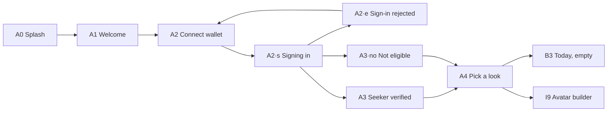

### B · Today
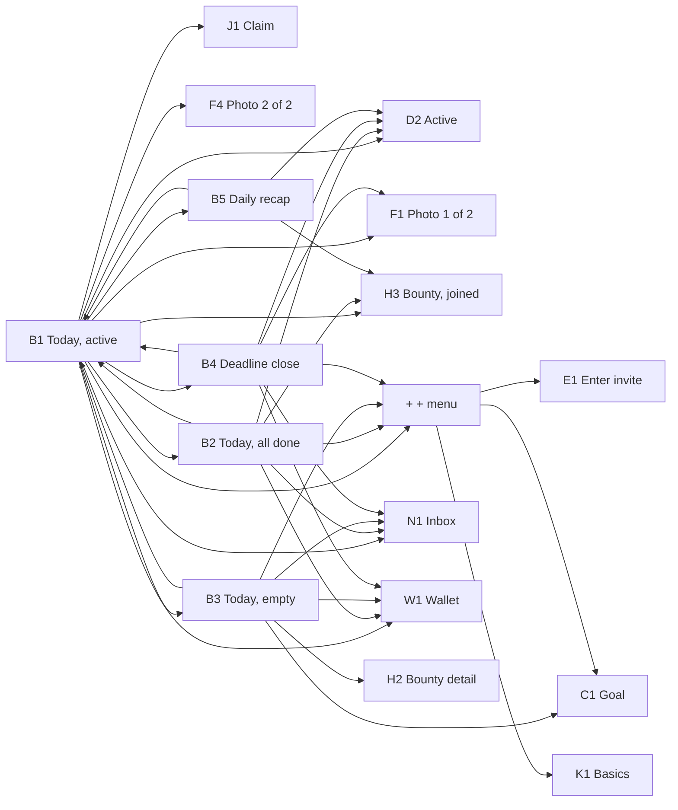

### N · Inbox
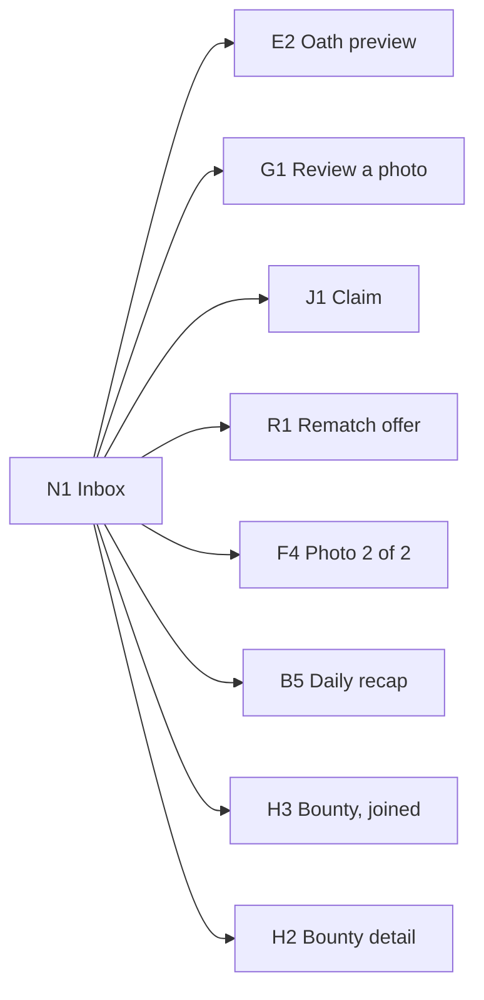

### C · Create an Oath
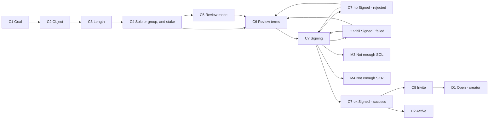

### D · Oaths
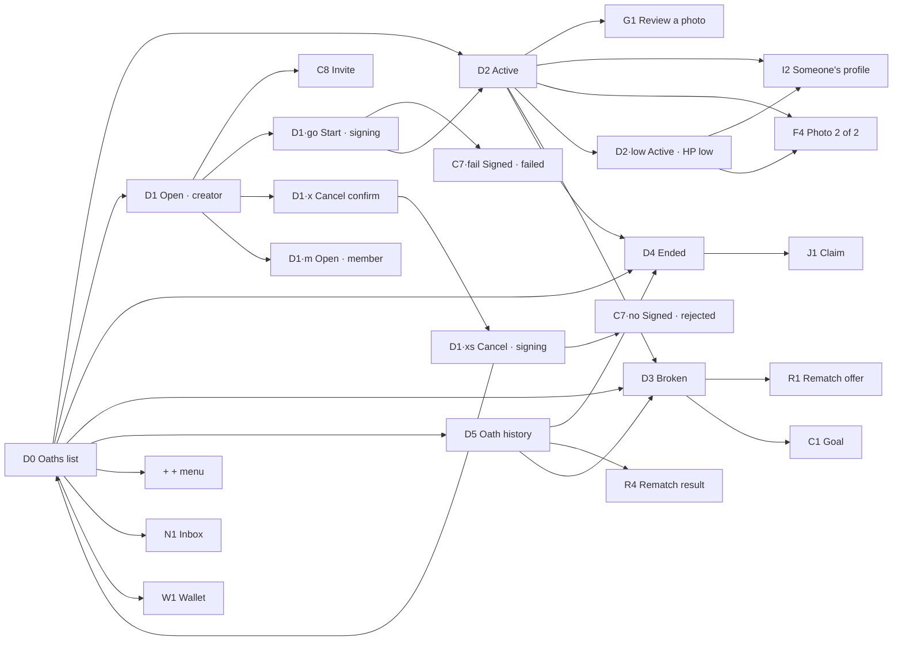

### E · Join an Oath
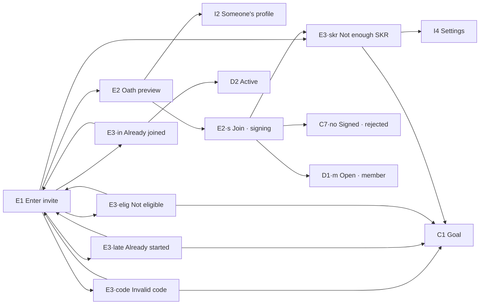

### R · Rematch
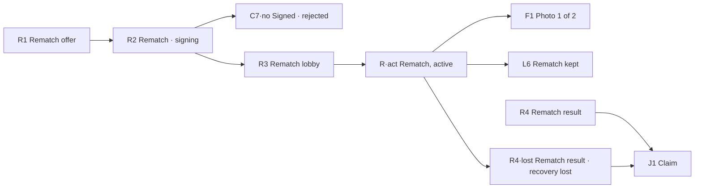

### F · Daily proof
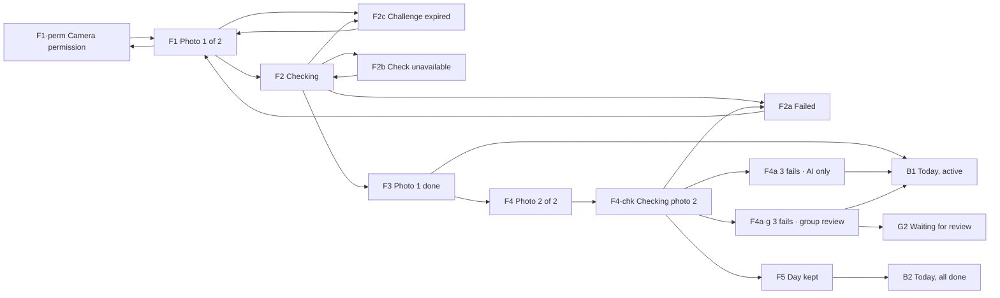

### G · Group review
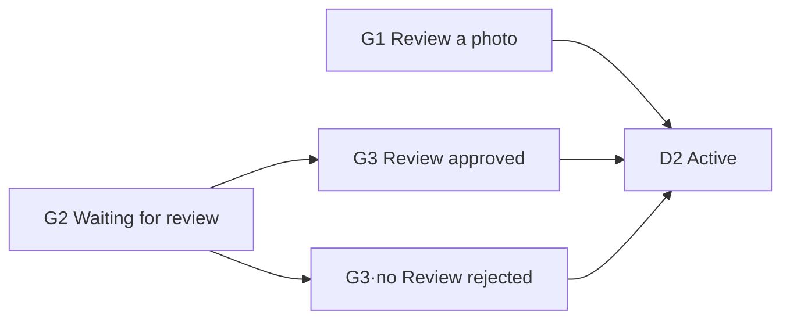

### H · Bounties
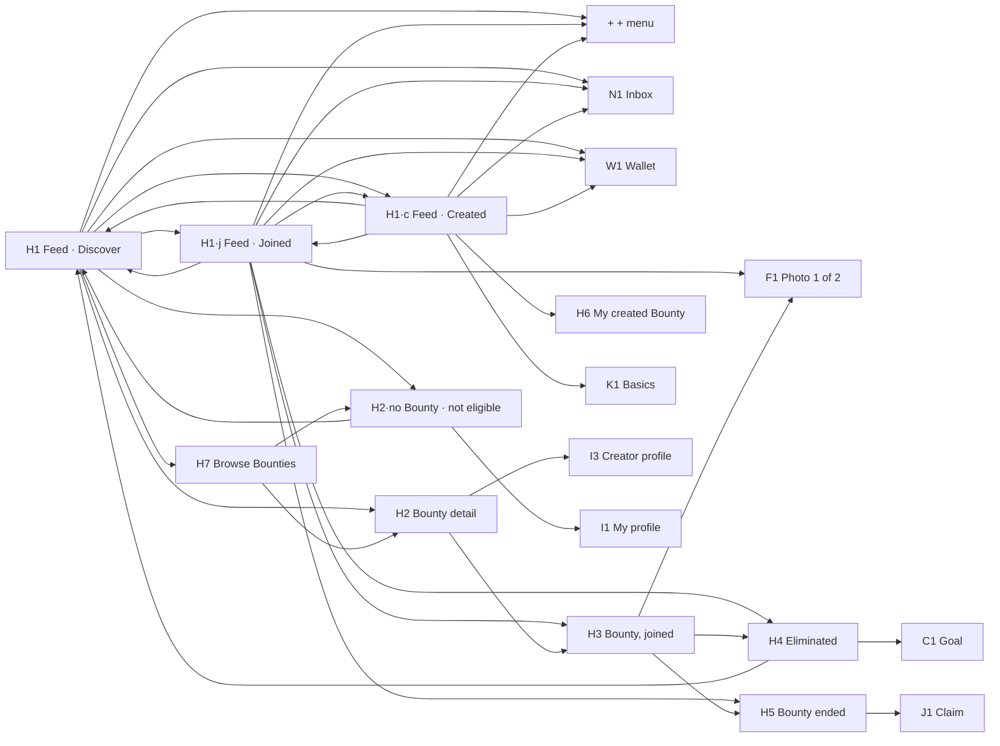

### I · Profiles
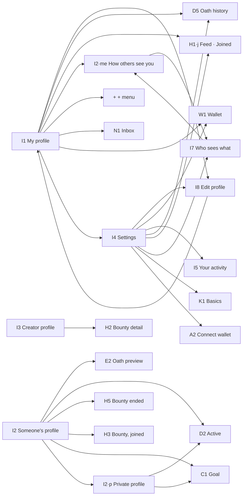

### W · Wallet
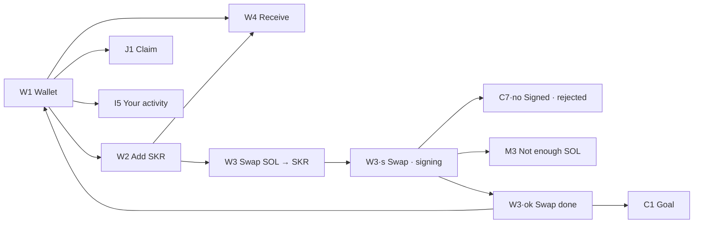

### J · Claim
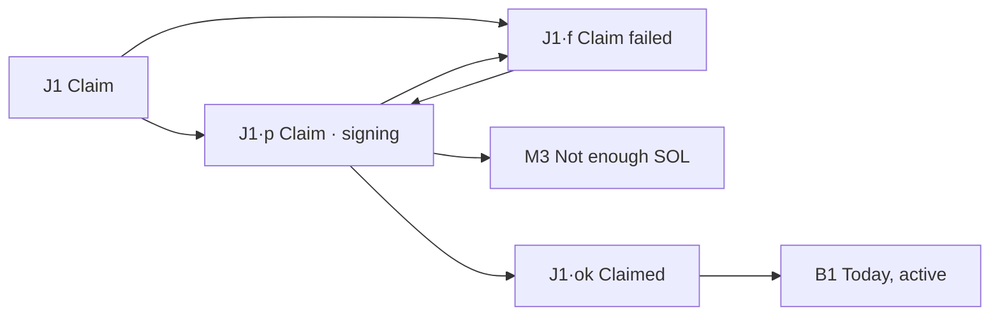

### K · Create a Bounty
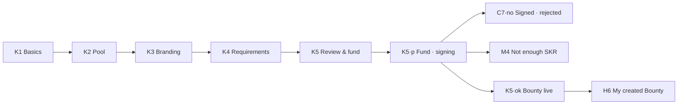

### L · Results
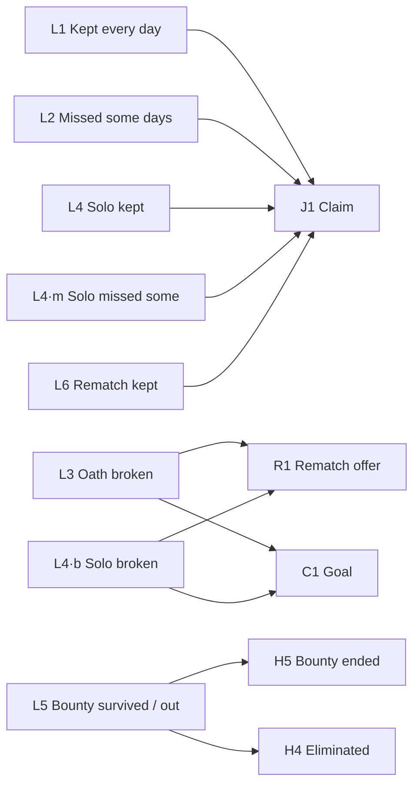

### M · Notifications & errors
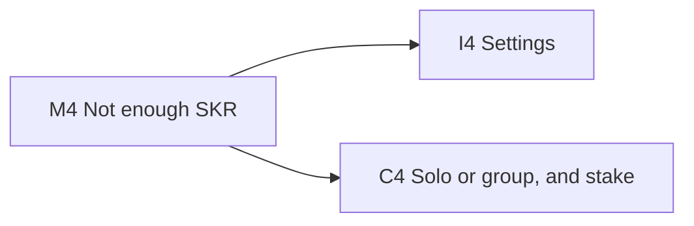

## Gaps the prototype only reaches through its screen map
- **A0** (Splash): app launch (cold start)
- **L1** (Kept every day): Oath settles (D2 after last day) — shown once, then D4
- **L2** (Missed some days): Oath settles with misses — shown once
- **L3** (Oath broken): Oath hits 0 HP — shown once, then D3
- **L4** (Solo kept): Solo Oath settles
- **L4·m** (Solo missed some): Solo Oath settles with misses
- **L4·b** (Solo broken): Solo Oath hits 0 HP
- **L5** (Bounty survived / out): Bounty ends / you are eliminated
- **M1** (Notifications): system notifications (push)
- **M2** (No internet): any network call fails (global)
- **C5** (Review mode): C4 when Group is selected
